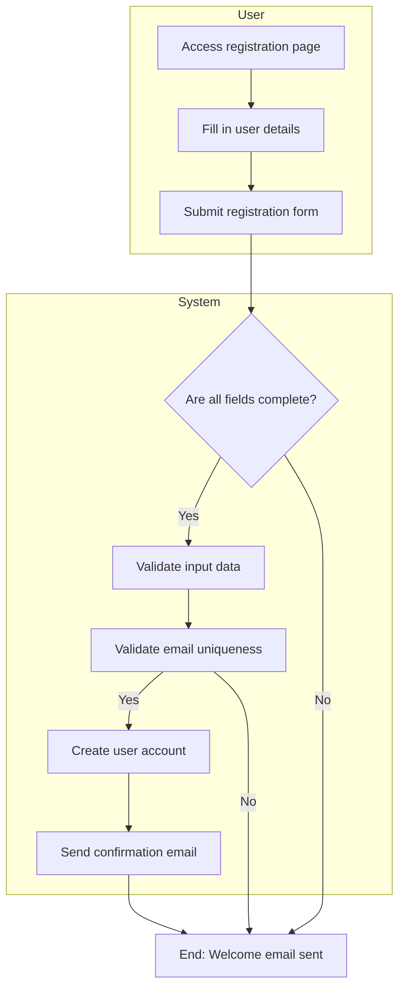
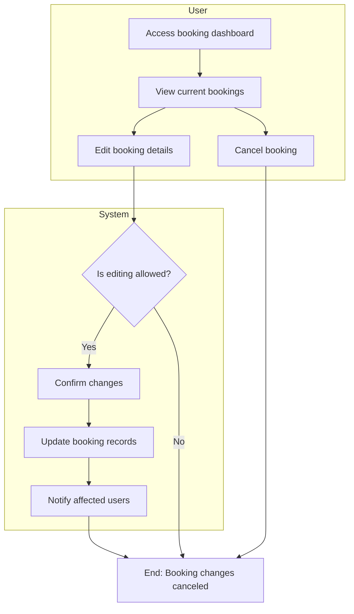
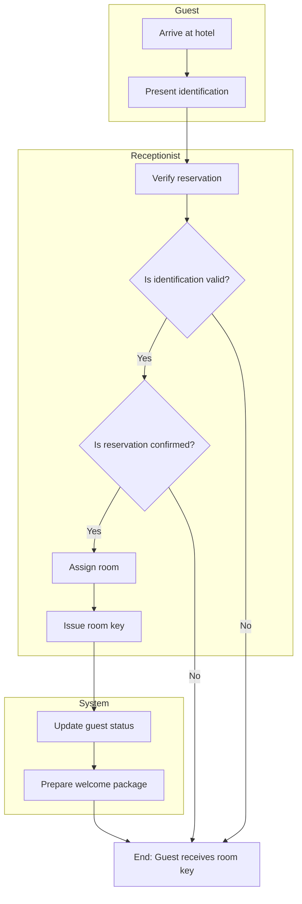
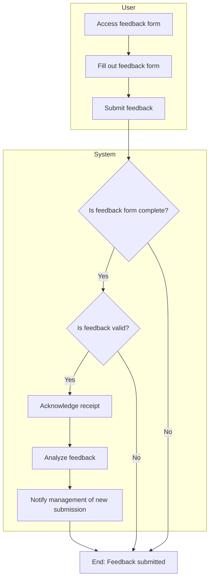
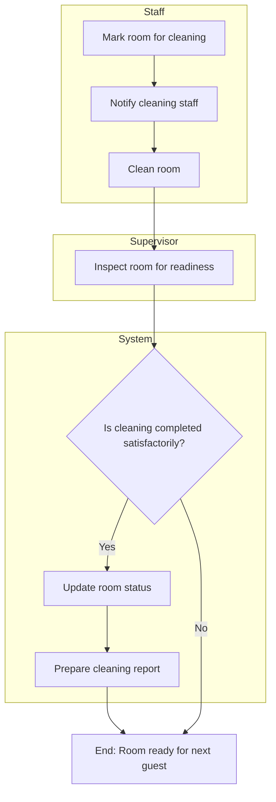
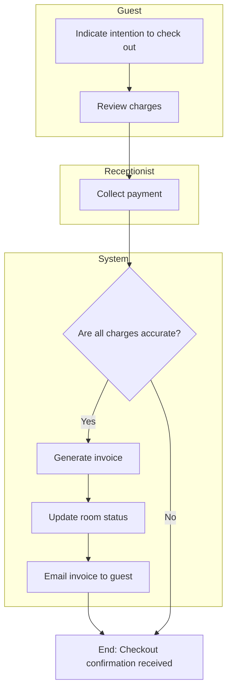
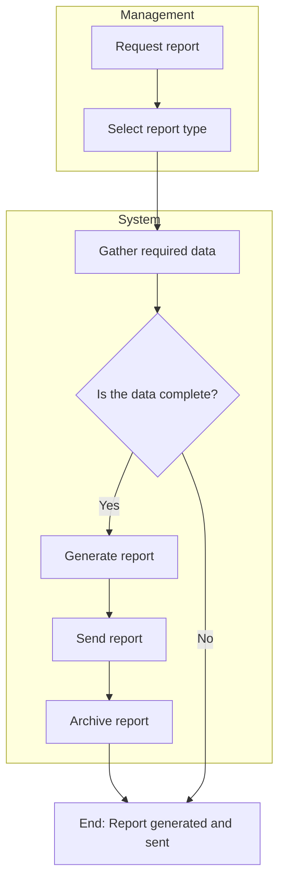

# Activity Workflow Modeling with UML Activity Diagrams

## 1. User Registration – Activity Diagram

## 2. Booking Management – Activity Diagram

## 3. Check-In Process – Activity Diagram

## 5. Feedback Submission – Activity Diagram

## 6. Room Cleaning Task – Activity Diagram

## 7. Checkout Process – Activity Diagram

## 8. Report Generation – Activity Diagram

