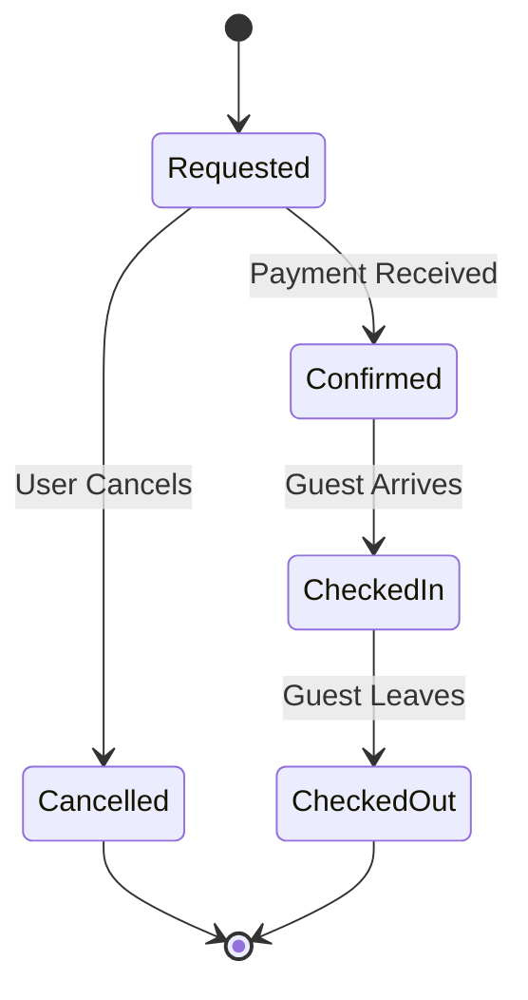
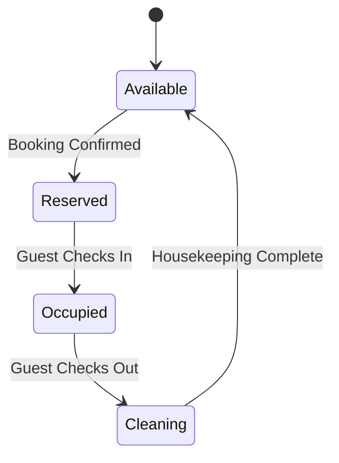
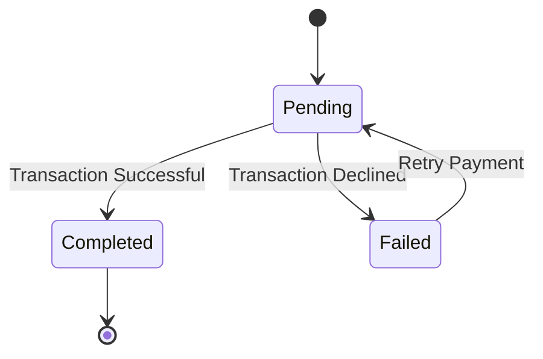
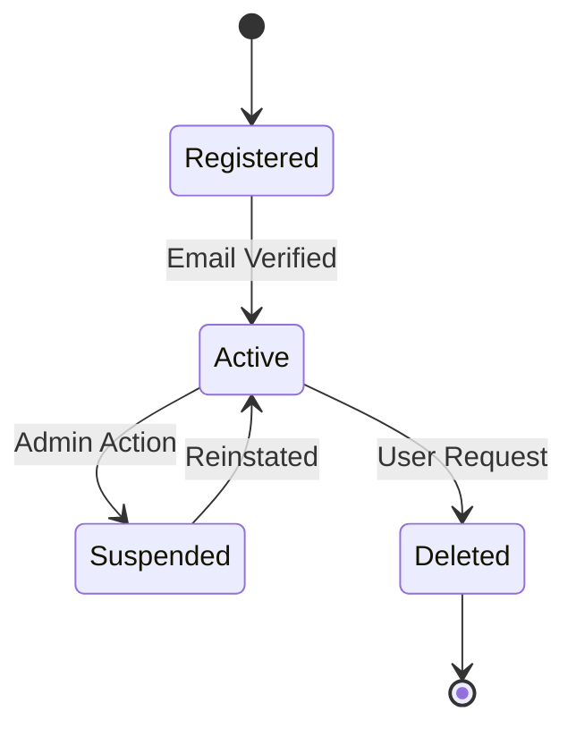
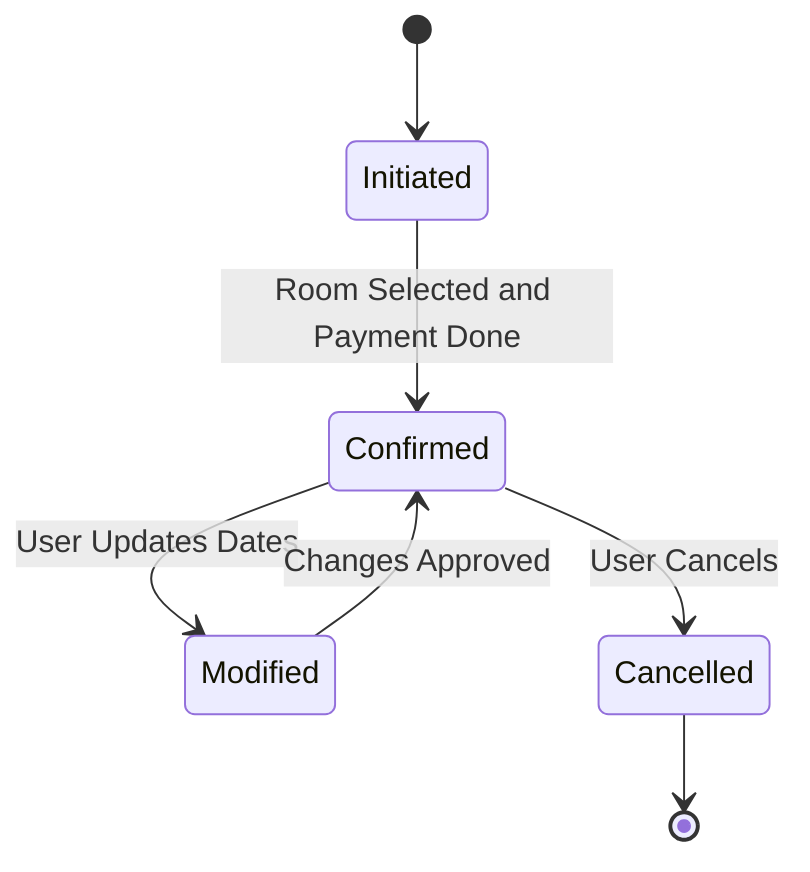
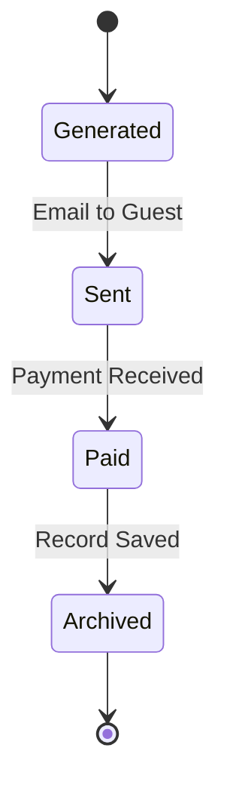
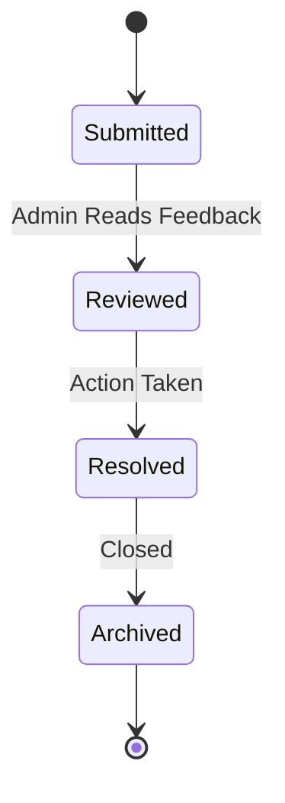
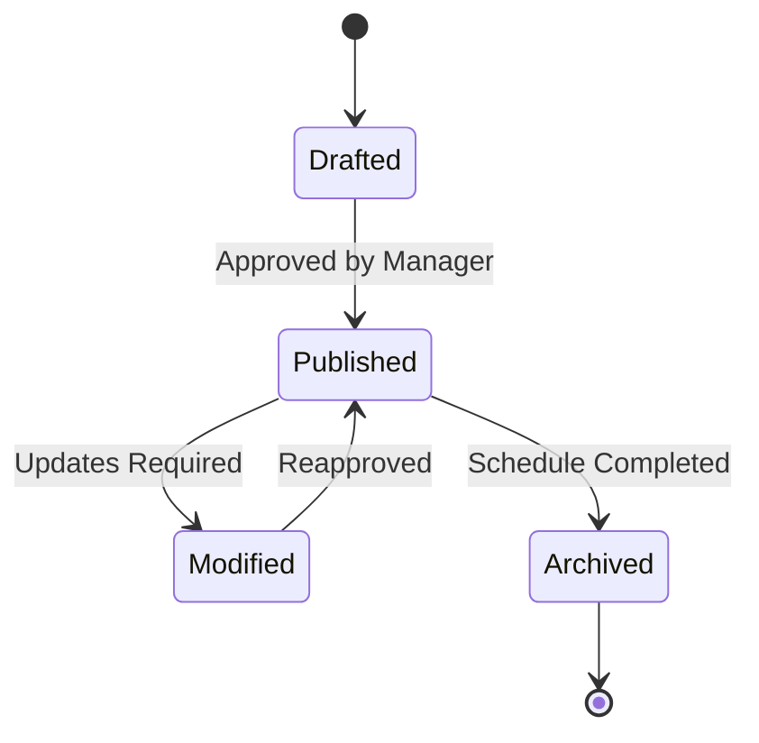

## Booking State Transition Diagram

## Room State Transition Diagram

## Payment State Transition Diagram

## User Account State Transition Diagram

## Reservation State Transition Diagram

## Invoice State Transition Diagram

## Invoice State Transition Diagram

## Staff Schedule State Transition Diagram

