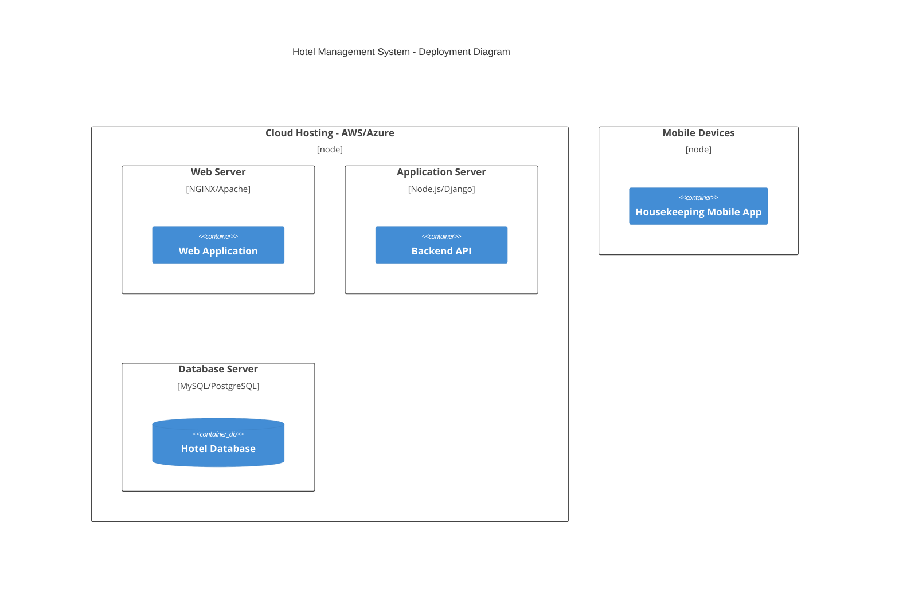

```mermaid
C4Context
  title Hotel Management System - Context Diagram
  Person(guest, "Guest", "A customer who books and stays at the hotel")
  Person(frontDesk, "Front Desk Staff", "Manages reservations and guest interactions")
  Person(housekeeping, "Housekeeping Staff", "Ensures rooms are cleaned and updated")
  Person(manager, "Hotel Manager", "Oversees hotel operations and finances")
  System(hms, "Hotel Management System", "Central system for managing hotel operations")
  System_Ext(paymentGateway, "Payment Gateway", "Handles secure transactions")
  
  guest --> hms : "Books a room online"
  frontDesk --> hms : "Manages reservations and check-ins"
  housekeeping --> hms : "Receives and updates room cleaning tasks"
  manager --> hms : "Views reports and manages staff"
  hms --> paymentGateway : "Processes payments"
```

```mermaid
C4Container
  title Hotel Management System - Container Diagram
  System_Boundary(hms, "Hotel Management System") {
    Container(webApp, "Web Application", "React/Angular")
    Container(mobileApp, "Mobile App", "React Native/Flutter")
    Container(api, "Backend API", "Node.js/Django")
    ContainerDb(database, "Database", "MySQL/PostgreSQL")
  }
  
  System_Ext(paymentGateway, "Payment Gateway")
  guest --> webApp : "Access online booking"
  frontDesk --> webApp : "Manages reservations"
  housekeeping --> mobileApp : "Receives tasks"
  webApp --> api : "Sends requests"
  mobileApp --> api : "Updates housekeeping tasks"
  api --> database : "Stores and retrieves data"
  api --> paymentGateway : "Processes transactions"
```

```mermaid
C4Component
  title Hotel Management System - Component Diagram
  Container_Boundary(api, "Backend API") {
    Component(reservationService, "Reservation Service")
    Component(customerService, "Customer Management")
    Component(housekeepingService, "Housekeeping Service")
    Component(financialService, "Financial Management")
    Component(inventoryService, "Inventory Management")
  }
  
  webApp --> reservationService : "Book rooms"
  webApp --> customerService : "Manage guest profiles"
  mobileApp --> housekeepingService : "Update room status"
  api --> financialService : "Process payments and payroll"
  api --> inventoryService : "Manage supplies"
```



I've removed unnecessary extra parameters and descriptions that might be causing rendering issues. Try again and let me know if any more fixes are needed!
