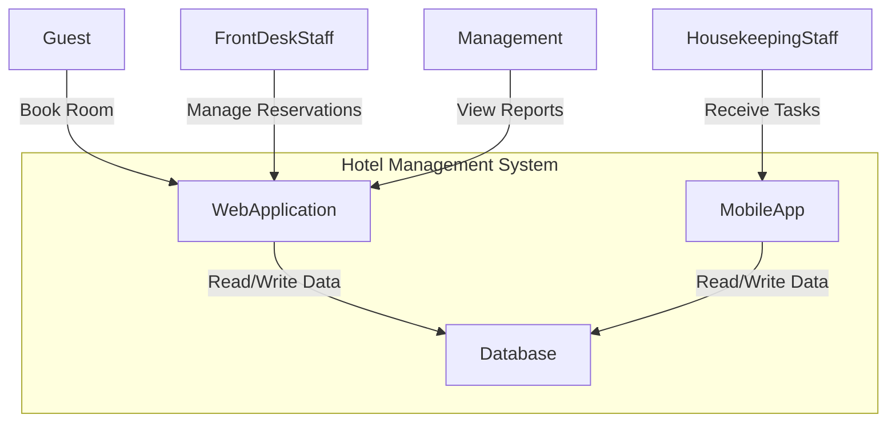
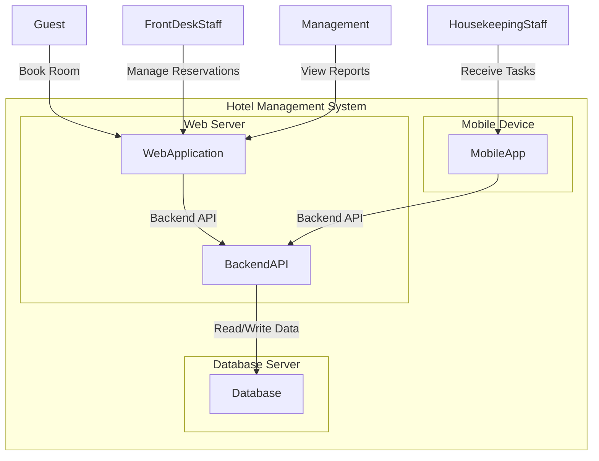
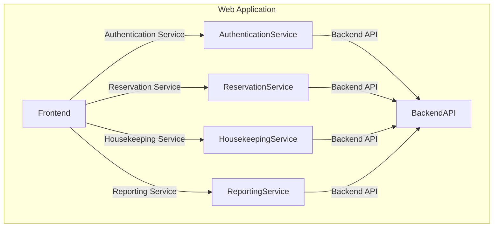
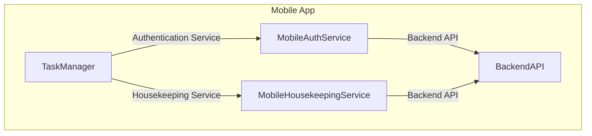
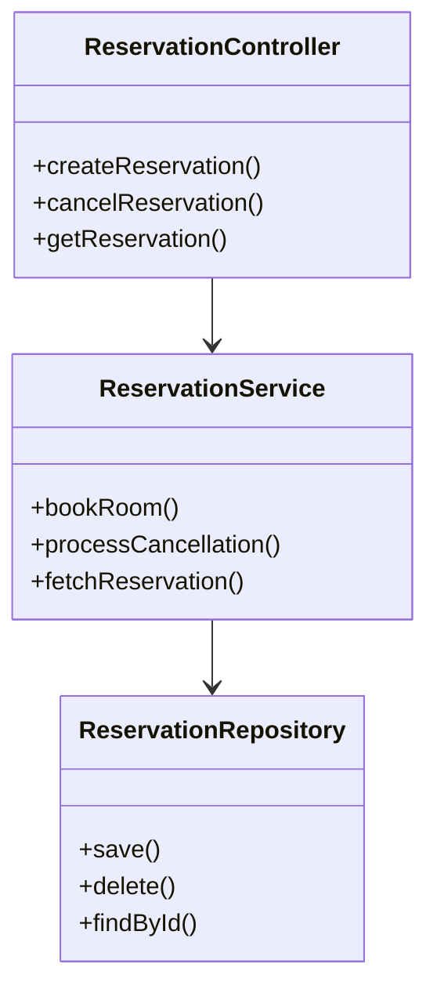

# Hotel Management System Architecture

## Introduction
This document outlines the C4 architectural diagrams for the Hotel Management System. The C4 model provides a simple yet powerful way to describe and visualize software architecture at different levels of abstraction.

## Level 1: System Context Diagram
The System Context Diagram provides a high-level overview of the Hotel Management System, showing how it interacts with external entities.

## Level 2: Container Diagram
The Container Diagram shows the high-level architecture of the Hotel Management System, including the major containers such as the web application, mobile app, and database.

## Level 3: Component Diagram
The Component Diagram provides a more detailed view of the internal structure of the Web Application and Mobile App, showing the key components and their interactions.

### Web Application Components

### Mobile App Components

## Level 4: Code Diagram
The Code Diagram provides a detailed view of the internal structure of a specific component, such as the Reservation Service.

### Reservation Service (Example in Node.js)

## Conclusion
The C4 architectural diagrams provide a comprehensive view of the Hotel Management System at different levels of abstraction. These diagrams help in understanding the system's structure, components, and interactions, facilitating better planning, development, and maintenance.
