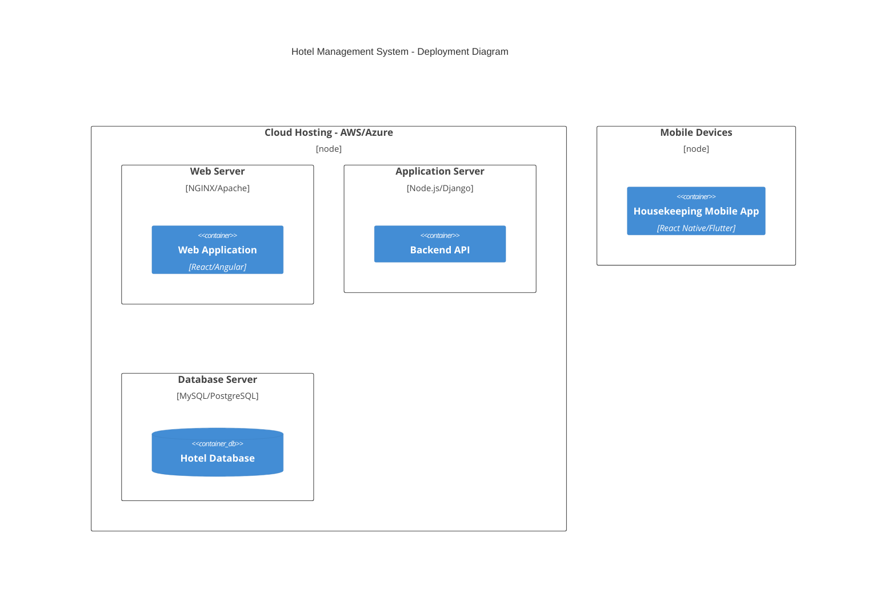

C4Context
  title Hotel Management System - Context Diagram
  Person(guest, "Guest", "A customer who books and stays at the hotel.")
  Person(frontDesk, "Front Desk Staff", "Manages reservations and guest interactions.")
  Person(housekeeping, "Housekeeping Staff", "Ensures rooms are cleaned and updated.")
  Person(manager, "Hotel Manager", "Oversees hotel operations and finances.")
  System(hms, "Hotel Management System", "Central system for managing hotel operations.")
  System_Ext(paymentGateway, "Payment Gateway", "Handles secure transactions.")
  
  guest --> hms : "Books a room online"
  frontDesk --> hms : "Manages reservations and check-ins"
  housekeeping --> hms : "Receives and updates room cleaning tasks"
  manager --> hms : "Views reports and manages staff"
  hms --> paymentGateway : "Processes payments"
```

```mermaid
C4Container
  title Hotel Management System - Container Diagram
  System_Boundary(hms, "Hotel Management System") {
    Container(webApp, "Web Application", "React/Angular", "Front-end interface for guests and staff.")
    Container(mobileApp, "Mobile App", "React Native/Flutter", "Used by housekeeping staff.")
    Container(api, "Backend API", "Node.js/Django", "Handles business logic and data processing.")
    ContainerDb(database, "Database", "MySQL/PostgreSQL", "Stores hotel-related data.")
  }
  
  System_Ext(paymentGateway, "Payment Gateway", "Handles secure transactions.")
  guest --> webApp : "Access online booking"
  frontDesk --> webApp : "Manages reservations"
  housekeeping --> mobileApp : "Receives tasks"
  webApp --> api : "Sends requests"
  mobileApp --> api : "Updates housekeeping tasks"
  api --> database : "Stores and retrieves data"
  api --> paymentGateway : "Processes transactions"
```

```mermaid
C4Component
  title Hotel Management System - Component Diagram
  Container_Boundary(api, "Backend API") {
    Component(reservationService, "Reservation Service", "Handles room bookings.")
    Component(customerService, "Customer Management", "Manages guest profiles.")
    Component(housekeepingService, "Housekeeping Service", "Assigns and tracks housekeeping tasks.")
    Component(financialService, "Financial Management", "Handles billing and payroll.")
    Component(inventoryService, "Inventory Management", "Manages supplies and amenities.")
  }
  
  webApp --> reservationService : "Book rooms"
  webApp --> customerService : "Manage guest profiles"
  mobileApp --> housekeepingService : "Update room status"
  api --> financialService : "Process payments and payroll"
  api --> inventoryService : "Manage supplies"
```



This covers all four levels:
- **Level 1 (Context)**: Shows the main system and its external interactions.
- **Level 2 (Container)**: Breaks the system into major components.
- **Level 3 (Component)**: Shows the internal services within the backend.
- **Level 4 (Deployment)**: Maps the system onto physical infrastructure.

Let me know if you need any modifications!
