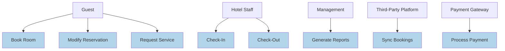

# Use Case Diagram

## Hotel Management System

```mermaid
%%{init: {'theme': 'default', 'themeVariables': {'actorColor': '#6A9BD1', 'useCaseFill': '#B3D5EA'}}}%%
graph TD
    %% Define the actors
    A[Guest] 
    B[Hotel Staff]
    C[Management]
    D[Third-Party Platform]
    E[Payment Gateway]

    %% Define the use cases
    UC1[Book Room]
    UC2[Check-In]
    UC3[Check-Out]
    UC4[Modify Reservation]
    UC5[Request Service]
    UC6[Generate Reports]
    UC7[Sync Bookings]
    UC8[Process Payment]

    %% Connect actors to use cases
    A --> UC1
    A --> UC4
    A --> UC5
    B --> UC2
    B --> UC3
    C --> UC6
    D --> UC7
    E --> UC8

    %% Style adjustments for clarity
    style UC1 fill:#B3D5EA
    style UC2 fill:#B3D5EA
    style UC3 fill:#B3D5EA
    style UC4 fill:#B3D5EA
    style UC5 fill:#B3D5EA
    style UC6 fill:#B3D5EA
    style UC7 fill:#B3D5EA
    style UC8 fill:#B3D5EA
```

